# ER 图 — idcd.com v2.0

> 生成日期:2026-05-13
> 数据库:PostgreSQL 16 + TimescaleDB 扩展
> 三栈 schema 隔离:`idcd_main` / `idcd_attest` / `idcd_mcp` / `idcd_audit`
> 跨 schema **不写 FK**(v2 D1),用 Repository 应用层 join(下图中 `..` 虚线 + `cross-schema` 标签)
> 关联源:`15-data-model.md`(§4 v1 核心表 + §4.X v2 新增 14 张表)

---

## 0. 阅读指南

- **实线 + `||--`** = 同 schema 内 FK 强约束(PostgreSQL `REFERENCES`)
- **虚线 + `..`** = 跨 schema 引用,**应用层 Repository.join**,**不写 FK**(v2 D1)
- 字段后跟的 `"枚举: a|b|c"` = CHECK 约束 + 业务可选值
- `PK` = 主键 / `UK` = 唯一约束 / `FK` = 外键
- TimescaleDB Hypertable 在字段区注释 `<<HYPERTABLE>>`
- 单图实体上限 ~25;大图拆为多 sub-section

---

## 1. 全局 ER 图(v1 + v2 三栈鸟瞰)

> 为可读性,本图只显示主干实体 + 跨 schema 关系;细节字段见后续分图。

```mermaid
erDiagram
    %% ============ idcd_main schema (业务库) ============
    user {
        text id PK "u_*"
        citext email UK
        text status "active|locked|pending_deletion|deleted"
    }
    team {
        text id PK "t_*"
        text owner_id FK "→ user"
        citext slug UK
    }
    api_key {
        text id PK "ak_*"
        text owner_id "user|team"
        text owner_type "user|team"
    }
    monitor {
        text id PK "m_*"
        text owner_id
        text type "http|ping|tcping|dns|ssl|domain|icp|keyword|json|heartbeat|browser|tx"
        text status "up|down|degraded|paused|maintenance|unknown"
    }
    alert_event {
        text id PK "ae_*"
        text monitor_id FK
        text severity "critical|warning|info"
    }
    status_page {
        text id PK "sp_*"
        text owner_id
        citext slug UK
    }
    node {
        text id PK "nd_*"
        text type "owned_idc|owned_cloud|anchor|community|dedicated|private"
        text status "provisioning|enrolling|observing|active|drained|disabled|banned|retired|offline"
    }
    subscription {
        text id PK "sub_*"
        text owner_id
        text plan_id FK
        text status "trial|active|past_due|canceled|expired"
    }
    order_t["order"] {
        text id PK "ord_*"
        text owner_id
        text status "pending|paid|failed|canceled|refunded"
    }
    agent_obs_monitor {
        text id PK "aom_*"
        text owner_id
        text type "llm|tool|rag|other"
        text status "active|paused|exceeded_budget"
    }
    compliance_subscription {
        text id PK "cs_*"
        text owner_id
        text tier "starter|pro|enterprise"
        int free_verdict_count
    }
    leaderboard_report {
        text id PK "lb_*"
        text status "draft|reviewing|published|archived"
        text verdict_report_id "cross-schema → idcd_attest"
    }

    %% ============ idcd_attest schema (Evidence 信任根) ============
    verdict_order {
        text id PK "v_*"
        text owner_id "cross-schema → user"
        text status "pending|paid|generating|delivered|failed|refunded|refund_failed"
        int refund_attempt_count
    }
    verdict_report {
        text id PK "vr_*"
        text order_id FK,UK
        text report_type "observation_only(default)"
        text confidence_label "high|medium|low"
    }
    attestation_record {
        text id PK "att_*"
        text report_id FK
        text action "signed|tsa_stamped|anchored|s3_archived|self_verified|revoked"
        text status "pending|success|failure"
    }
    tsa_response {
        text id PK "tsa_*"
        text provider "digicert|globalsign|ntsc"
        text used_by_report_id FK
        text status "success|failure|timeout"
    }
    key_ceremony_log {
        text id PK "kc_*"
        text action "root_gen|root_split|sign_key_rotate|emergency_revoke"
    }

    %% ============ idcd_mcp schema (MCP sub-product) ============
    mcp_token {
        text id PK "mcpt_*"
        text owner_id "cross-schema → user/team"
        text type "personal|workspace|service"
        timestamptz expires_at "NOT NULL,最长 90d"
        bool auto_renew
    }
    mcp_session {
        text id PK "mcps_*"
        text token_id FK
        text owner_id "cross-schema → user"
        text client_id "Cursor|ClaudeCode|Codex|sdk-py|sdk-ts|other"
    }
    mcp_tool_call {
        text id PK "mctc_*"
        text session_id FK
        text owner_id "cross-schema"
        text tool_name "idcd_ping|idcd_http_probe|..."
        text status "success|failure|timeout|rate_limited"
    }

    %% ============ idcd_audit schema (只增不删) ============
    admin_audit_log {
        text id PK
        text admin_user_id
        text action
    }
    audit_log {
        text id PK "al_*"
        text actor_user_id "cross-schema → user"
        text result "ok|fail"
    }

    %% ============ 同 schema 关系(实线) ============
    user ||--o{ team : "owns"
    user ||--o{ api_key : "creates"
    user ||--o{ monitor : "owns"
    monitor ||--o{ alert_event : "raises"
    user ||--o{ status_page : "owns"
    user ||--o{ subscription : "has"
    subscription ||--o{ order_t : "billing"
    user ||--o{ agent_obs_monitor : "configures"
    verdict_order ||--|| verdict_report : "has"
    verdict_report ||--o{ attestation_record : "WAL records"
    verdict_report ||--o{ tsa_response : "uses"
    mcp_token ||--o{ mcp_session : "auths"
    mcp_session ||--o{ mcp_tool_call : "produces"

    %% ============ 跨 schema 关系(虚线,Repository join,无 FK) ============
    user ||..o{ verdict_order : "cross-schema: owner_id"
    user ||..o{ mcp_token : "cross-schema: owner_id"
    user ||..o{ mcp_session : "cross-schema: owner_id"
    team ||..o{ compliance_subscription : "cross-schema: owner_id"
    compliance_subscription ||..o{ verdict_order : "cross-schema: free_verdict_count uses"
    verdict_report ||..o{ leaderboard_report : "cross-schema: verdict_report_id"
    user ||..o{ audit_log : "cross-schema: actor_user_id"
    user ||..o{ admin_audit_log : "cross-schema: admin_user_id"
```

---

## 2. 按 schema 分图

### 2.1 idcd_attest schema(Evidence 信任根 / v2 新增)

> 涉及 v2 决策:**D1** 跨 schema 不 FK、**D4** WAL 设计、**D5** refund_failed 状态、**D-Concern1** report_type 仅 observation_only、**D-Concern3** errata 勘误模式。

```mermaid
erDiagram
    verdict_order {
        text id PK "v_*"
        text owner_id "cross-schema → idcd_main.user(Repository join)"
        text template "sla|incident|compliance|legal"
        text target "domain|url|ip"
        timestamptz time_window_start
        timestamptz time_window_end
        text status "pending|paid|generating|delivered|failed|refunded|refund_failed"
        numeric price_cny
        numeric price_paid_cny
        text paddle_order_id "cross-schema → idcd_main.order"
        text refund_reason
        int refund_attempt_count "v2 D5: retry queue 计数"
        text refund_last_error "v2 D5"
        timestamptz refund_apology_sent_at "v2 D5: 30min 兜底邮件"
        timestamptz created_at
        timestamptz paid_at
        timestamptz delivered_at
        timestamptz failed_at
        timestamptz refunded_at
    }
    verdict_report {
        text id PK "vr_*"
        text order_id FK,UK "→ verdict_order"
        text pdf_url "S3 path"
        bigint pdf_size_bytes
        text content_hash "sha256(pdf bytes)"
        bytea signature "KMS sign output"
        text signature_key_id
        int signature_key_version
        text tsa_provider "digicert|globalsign|ntsc"
        bytea tsa_response_blob
        timestamptz tsa_time
        jsonb blockchain_anchor "OPTIONAL: chain+tx_hash"
        jsonb nodes_used "[node_id,...]"
        numeric node_consistency_pct
        bool llm_used
        text llm_model
        text llm_prompt_version
        text self_verify_status "pass|fail|pending"
        timestamptz self_verify_at
        text confidence_label "high|medium|low"
        text report_type "observation_only(default) - v2 D-Concern1"
        text archived_url "S3 WORM 永久归档"
        timestamptz created_at
    }
    attestation_record {
        text id PK "att_*"
        text report_id FK "→ verdict_report"
        text action "signed|tsa_stamped|anchored|s3_archived|self_verified|revoked"
        text status "pending|success|failure - v2 D4 WAL"
        text external_id "TSA serial|chain tx|KMS req|S3 ETag"
        text idempotency_key "v2 D4: 外部 API token"
        text payload_hash
        text result "success|failure"
        text error_detail
        int retry_count "v2 D4: <=3"
        timestamptz created_at
        timestamptz completed_at
        UK report_id_action "UNIQUE(report_id, action) - v2 D4 step-level idempotency"
    }
    tsa_response {
        text id PK "tsa_*"
        text provider "digicert|globalsign|ntsc"
        text request_hash
        bytea response_blob
        text serial_number
        timestamptz issued_at
        timestamptz valid_until
        text status "success|failure|timeout"
        int latency_ms
        text used_by_report_id FK "→ verdict_report"
        timestamptz created_at
    }
    key_ceremony_log {
        text id PK "kc_*"
        text action "root_gen|root_split|sign_key_rotate|emergency_revoke"
        text key_id
        int key_version
        jsonb actors "[{user_id|external_id, role},...]"
        text evidence_url "录像 / 公证 PDF"
        text notes
        timestamptz created_at
    }

    verdict_order ||--|| verdict_report : "1:1 has report"
    verdict_report ||--o{ attestation_record : "WAL step records (v2 D4)"
    verdict_report ||--o{ tsa_response : "used by"
```

**说明**:
- `attestation_record` 是 Verdict 生成流程的 **WAL**(v2 D4):每完成一 step 写入 (report_id, action, status=success);worker crash 后查已 success steps 跳过续跑。
- `UNIQUE(report_id, action)` 保证 step-level 严格幂等(防重签 / 重盖时间戳 / 重归档)。
- `verdict_order.status = 'refund_failed'`(v2 D5)是兜底状态,触发 P0 告警 + admin dashboard 处理。
- `verdict_report.report_type` 默认 `observation_only`(v2 D-Concern1),公开 verify 接口返回此值,避免被误用为司法鉴定结论。S4 可升级为 `sworn_observer`(司法鉴定所合作通道)。

---

### 2.2 idcd_mcp schema(MCP sub-product / v2 新增)

> 涉及 v2 决策:**D1** 跨 schema 不 FK、**D2** token 必有过期日(最长 90d)+ auto_renew、**D7** 失败 case payload 临时 7d、**K-数据** payload_hash 哈希存储(用户 prompt 隐私)。

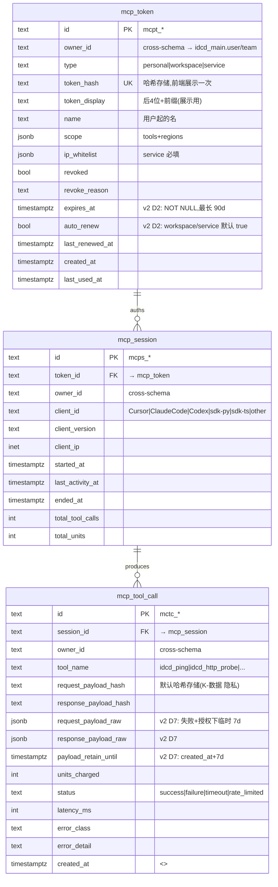

**说明**:
- `mcp_token.expires_at NOT NULL`(v2 D2):严格"无永久 token";personal 24h / workspace 90d / service 90d 全自动 renewal。
- `mcp_tool_call` 高频写入(每次 tool 调用 1 行),用 **TimescaleDB Hypertable** 按 day 分区。
- 索引:`(owner_id, created_at DESC)` + `(session_id, created_at DESC)`(v2 D7 排障)。
- `request_payload_raw / response_payload_raw`(v2 D7):仅当用户在 `/app/mcp/settings` 显式开启"失败 case 7d 保留"时,失败调用才存原 payload;cron 自动清理过期。

---

### 2.3 idcd_main schema(业务 — 用户/团队/认证)

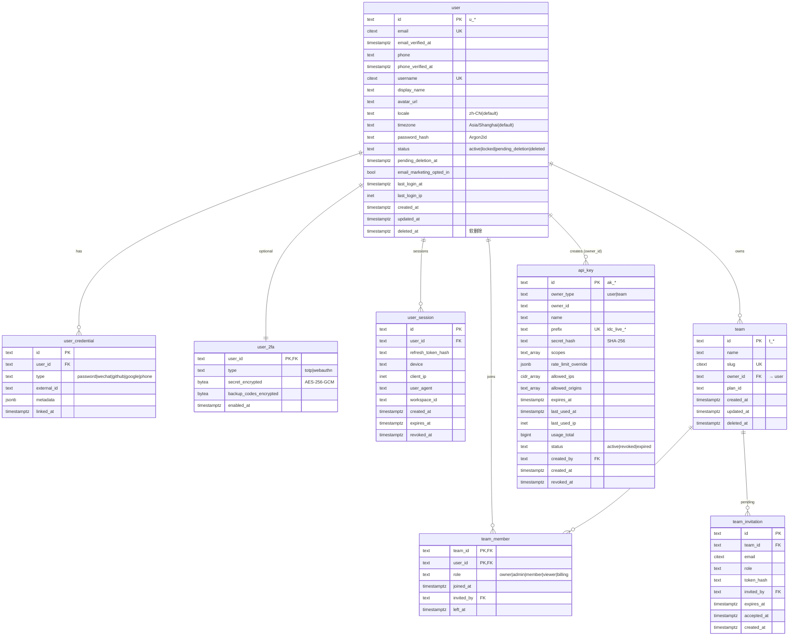

---

### 2.4 idcd_main schema(业务 — 监控 / 告警 / 状态页)

```mermaid
erDiagram
    monitor {
        text id PK "m_*"
        text owner_type "user|team"
        text owner_id
        text group_id FK
        text name
        text type "http|ping|tcping|dns|ssl|domain|icp|keyword|json|heartbeat|browser|tx"
        text target
        jsonb params
        int interval_sec
        jsonb node_selection
        jsonb assertions
        jsonb trigger_rule
        text alert_policy_id FK
        text_array tags
        text status "up|down|degraded|paused|maintenance|unknown"
        int current_streak_count
        timestamptz current_streak_start_at
        timestamptz last_check_at
        text last_result_id
        timestamptz paused_at
        timestamptz created_at
        timestamptz deleted_at
    }
    monitor_group {
        text id PK
        text owner_id
        text name
        text parent_id FK "self-ref"
        timestamptz created_at
    }
    maintenance_window {
        text id PK
        text owner_id
        text name
        text scope_type "monitor|tag|all"
        jsonb scope_value
        timestamptz start_at
        timestamptz end_at
        text cron_expr
        text timezone
    }
    monitor_check {
        text id PK "mc_*"
        text monitor_id FK
        timestamptz started_at PK "<<HYPERTABLE 按 day>>"
        timestamptz finished_at
        text result "up|degraded|down|error"
        jsonb node_results
        jsonb summary
        text triggered_event_id
    }
    alert_policy {
        text id PK "ap_*"
        text owner_id
        text name
        jsonb rules
        jsonb escalation
        jsonb suppression
        jsonb mute
        jsonb on_recovery
        bool is_default
    }
    channel {
        text id PK "ch_*"
        text owner_id
        text type "email|webhook|wecom_robot|..."
        text name
        bytea config_encrypted "AES-256-GCM"
        text health "ok|fail|paused"
        timestamptz last_test_at
        text last_test_result
    }
    alert_event {
        text id PK "ae_*"
        text monitor_id FK
        text owner_id
        text type "down|up|degraded"
        text severity "critical|warning|info"
        timestamptz started_at
        timestamptz ended_at
        int duration_sec
        text reason
        jsonb affected_nodes
        text acknowledged_by FK
        timestamptz acked_at
        text resolved_by FK
        timestamptz resolved_at
        text resolved_kind "auto|manual"
        bool is_false_positive
    }
    alert_notification {
        text id PK
        text event_id FK
        text channel_id FK
        text channel_type
        jsonb payload
        timestamptz sent_at
        text delivery_status "queued|sent|failed|retrying"
        int attempts
        text last_error
        int latency_ms
    }
    alert_comment {
        text id PK
        text event_id FK
        text user_id FK
        text body
        text_array mentioned_users
        timestamptz created_at
    }
    status_page {
        text id PK "sp_*"
        text owner_id
        citext slug UK
        text name
        text default_domain
        text custom_domain UK
        timestamptz custom_domain_verified_at
        text cert_status
        text visibility "public|password|private"
        text password_hash
        jsonb design
        bool watermark_enabled
        jsonb i18n
        timestamptz deleted_at
    }
    status_section {
        text id PK
        text status_page_id FK
        text name
        int position
    }
    status_component {
        text id PK "sc_*"
        text status_page_id FK
        text section_id FK
        text name
        int position
        text source_type "monitor|manual|api"
        text_array monitor_ids
        text aggregation_rule "any_down(default)"
        text current_status "operational(default)"
    }
    status_incident {
        text id PK "inc_*"
        text status_page_id FK
        text title
        text status "investigating|identified|monitoring|resolved"
        text impact "minor|major|critical|maintenance"
        text_array affected_components
        text visibility "public(default)"
        bool notify_subscribers
        bool auto_close_on_recovery
        text source "auto|manual|api"
        text related_alert_event_id
        timestamptz started_at
        timestamptz resolved_at
        timestamptz postmortem_published_at
    }
    status_incident_update {
        text id PK
        text incident_id FK
        text status
        text body
        text posted_by
        timestamptz posted_at
    }
    status_subscriber {
        text id PK
        text status_page_id FK
        text channel
        text contact
        timestamptz verified_at
        timestamptz subscribed_at
        bool notify_on_minor
        bool notify_on_maintenance
    }

    monitor ||--o{ monitor_check : "results (HYPERTABLE)"
    monitor ||--o{ alert_event : "raises"
    monitor }o--o| alert_policy : "policy"
    monitor }o--o| monitor_group : "in group"
    monitor_group ||--o{ monitor_group : "self (parent)"
    alert_event ||--o{ alert_notification : "fans out"
    alert_event ||--o{ alert_comment : "discussion"
    channel ||--o{ alert_notification : "delivers"
    status_page ||--o{ status_section : "groups"
    status_page ||--o{ status_component : "exposes"
    status_section ||--o{ status_component : "contains"
    status_page ||--o{ status_incident : "has"
    status_incident ||--o{ status_incident_update : "updates"
    status_page ||--o{ status_subscriber : "subscribers"
```

---

### 2.5 idcd_main schema(业务 — 节点 / 拨测 / 众包)

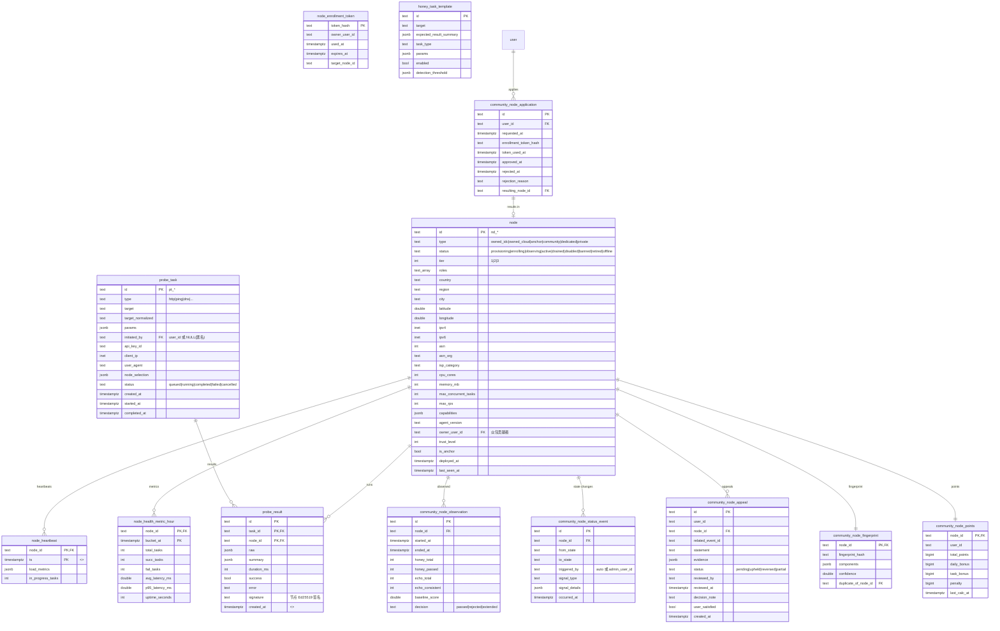

---

### 2.6 idcd_main schema(业务 — 商业化 / 计费)

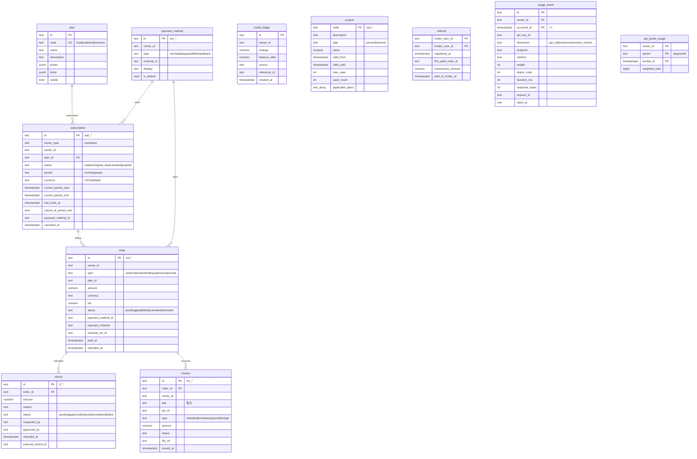

---

### 2.7 idcd_main schema(业务 — Agent Obs / Compliance / Leaderboard / Webhook / 工单)

```mermaid
erDiagram
    agent_obs_monitor {
        text id PK "aom_*"
        text owner_id "cross-schema → user"
        text agent_name
        text step_name
        text type "llm|tool|rag|other"
        text endpoint_url
        jsonb endpoint_config
        int frequency_seconds
        numeric budget_per_check_usd "M21 必填"
        jsonb failure_threshold
        jsonb notification_channels
        text status "active|paused|exceeded_budget"
        numeric total_cost_this_month_usd "v2 D7: 原子 UPDATE"
        timestamptz created_at
        timestamptz paused_at
    }
    agent_obs_event {
        text id PK "aoe_*"
        text monitor_id FK "→ agent_obs_monitor(同 schema FK)"
        text owner_id
        text region
        timestamptz occurred_at "<<HYPERTABLE 按 day>>"
        int latency_ms
        bool success
        text failure_class "timeout|4xx|5xx|malformed|semantic|budget"
        jsonb failure_detail
        numeric cost_usd
        text trace_id
    }
    compliance_subscription {
        text id PK "cs_*"
        text owner_id "cross-schema"
        text tier "starter|pro|enterprise"
        text status "active|past_due|canceled|expired"
        timestamptz period_start
        timestamptz period_end
        int monitors_quota
        text reports_frequency "monthly|weekly|custom"
        int history_retention_months
        int free_verdict_count "Pro=5 / Enterprise=不限"
        int free_verdict_used
        numeric price_cny
        text paddle_subscription_id
        timestamptz canceled_at
    }
    leaderboard_report {
        text id PK "lb_YYYY_MM"
        int period_year
        int period_month UK
        jsonb data
        text methodology_version
        jsonb excluded_vendors
        text pdf_url
        text verdict_report_id "cross-schema → idcd_attest.verdict_report"
        text status "draft|reviewing|published|archived"
        text reviewer_id "cross-schema"
        text errata_pdf_url "v2 D-Concern3: 已发布后修订 = 勘误,不删原"
        text errata_reason "v2 D-Concern3"
        timestamptz published_at
    }
    leaderboard_optout_request {
        text id PK
        text vendor_name
        text applicant_email
        text applicant_organization
        text reason
        text contact_phone
        text identity_proof_url
        text status "pending|approved|rejected"
        text reviewer_id "cross-schema → admin_user"
        text decision_reason
        timestamptz decided_at
    }
    webhook_endpoint {
        text id PK "we_*"
        text owner_id
        text name
        text url
        text secret_hash
        text_array events
        bool is_active
        timestamptz last_delivery_at
        text last_status
    }
    webhook_delivery {
        text id PK
        text endpoint_id FK
        text event_id "evt_*"
        text event_type
        int attempt
        jsonb request_payload
        int response_status
        text response_body
        int latency_ms
        timestamptz next_retry_at
        timestamptz delivered_at
        timestamptz failed_at
    }
    ticket {
        text id PK "tk_*"
        text type "support|abuse|security|billing|refund"
        text user_id
        text subject
        text body
        text status "open|waiting_user|resolved|closed"
        text assignee_admin_id
        text priority "low|normal|high|urgent"
        timestamptz sla_due_at
        int satisfaction_score
        jsonb metadata
        timestamptz resolved_at
    }
    ticket_message {
        text id PK
        text ticket_id FK
        text author_type "user|admin"
        text author_id
        text body
        bool is_internal_note
        jsonb attachments
    }
    report {
        text id PK "r_*"
        text diagnosis_id
        text_array task_ids
        text target_domain
        text owner_id "nullable(匿名)"
        text visibility "public|private|password"
        text password_hash
        timestamptz expires_at
        jsonb summary
        int score
        text status "running|done|failed"
    }
    sla_report {
        text id PK
        text owner_id
        text period "month|quarter|year"
        date period_start
        date period_end
        double uptime_overall
        int mtta_avg
        int mttr_avg
        int events_count
        int critical_events_count
        jsonb monitors_breakdown
        text file_url
    }
    dashboard {
        text id PK "db_*"
        text owner_id
        text name
        jsonb layout
        jsonb variables
        text shared_token
    }

    agent_obs_monitor ||--o{ agent_obs_event : "produces (HYPERTABLE)"
    webhook_endpoint ||--o{ webhook_delivery : "delivers"
    ticket ||--o{ ticket_message : "discussion"
```

---

### 2.8 idcd_main schema(反滥用 / 缓存表)

```mermaid
erDiagram
    denylist {
        text id PK
        text category "tech|sensitive|dynamic|user_reported"
        text pattern_type "cidr|domain|regex"
        text pattern
        text reason
        text added_by
        timestamptz expires_at
    }
    rate_limit_override {
        text id PK
        text scope_type "user|target|api_key|global"
        text scope_value
        text dimension
        jsonb override_value
        text reason
    }
    abuse_report {
        text id PK
        text type
        text reporter_email
        inet reporter_ip
        text target
        text related_resource_type
        text related_resource_id
        text status "open(default)"
        text assigned_admin_id
        jsonb evidence
        text resolution
        timestamptz resolved_at
    }
    user_risk_score {
        text user_id PK,FK
        int score "0=最高风险,100=最低"
        jsonb factors
        timestamptz last_calc_at
    }
    ip_info_cache {
        inet ip PK
        int asn
        text asn_org
        text isp
        text country
        text region
        text city
        jsonb raw
        text source
        timestamptz fetched_at
        timestamptz ttl_until
    }
    whois_cache {
        text key PK "domain or ip"
        text raw
        jsonb parsed
        timestamptz fetched_at
        timestamptz ttl_until
    }
    icp_cache {
        text domain PK
        jsonb parsed
        timestamptz fetched_at
        timestamptz ttl_until
    }
    ssl_cache {
        text key PK "host:port"
        jsonb parsed
        timestamptz fetched_at
        timestamptz ttl_until
    }
```

> 这些表大多独立(无 FK 关系),`user_risk_score` 是唯一对 `user` 有 FK 的表(1:1)。

---

### 2.9 idcd_audit schema(审计只增不删)

> 这两张表写入大,独立到 `idcd_audit` 库。`audit_log` 是 TimescaleDB Hypertable(按 7 天分区)。

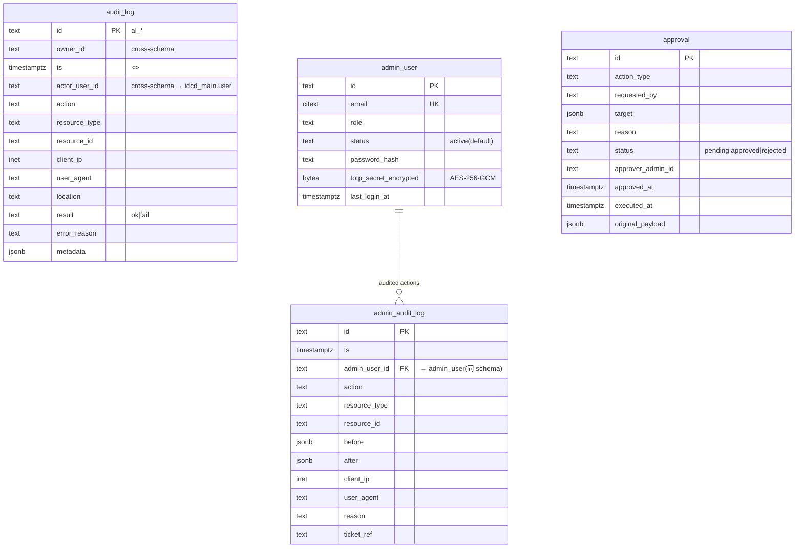

> 注意:`admin_audit_log` 中 `admin_user_id` 在同 `idcd_audit` schema 内,FK 保留;`audit_log.actor_user_id` 跨 schema → `idcd_main.user`,**不写 FK**(v2 D1)。

---

### 2.10 cert schema(免费证书模块,S2 上线)

> 详 [`20-free-cert.md §5`](./20-free-cert.md#5-领域模型与数据表) / [`15-data-model.md §4.X.15`](./15-data-model.md#4x15-cert-schemav2-免费证书模块-s2-上线)。
>
> **D1 跨 schema 不写 FK**:`cert.orders.account_id` / `cert.dns_credentials.account_id` / `cert.certs.account_id` 等列指向 `account.users.id` 但**不**声明 FK,走 Repository 应用层 join。

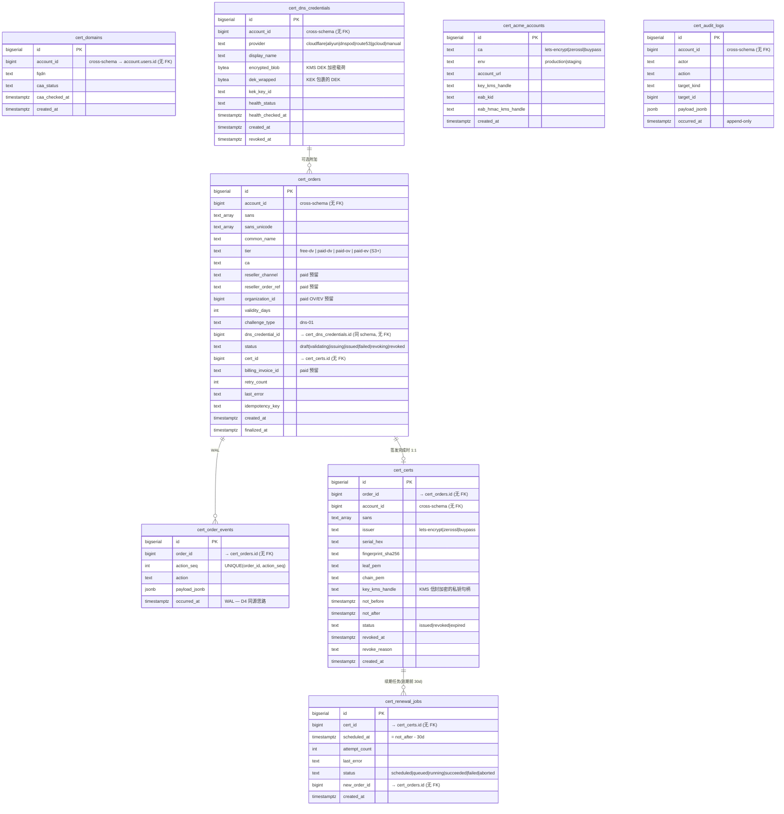

> 注意:`cert.acme_accounts` / `cert.audit_logs` 与其他表无显式关系(账号级与审计独立)。`cert.domains` 是缓存表(CAA 状态),不强制与 orders 关联 — 同一域名可多次签发不同 SANs 组合。

---

## 3. 关键设计说明

### 3.1 跨 schema FK 不写(v2 D1)

| 跨 schema 引用 | 来源表(schema) | 目标表(schema) | join 方式 |
|---|---|---|---|
| `verdict_order.owner_id` | idcd_attest | idcd_main.user | Repository.GetUser(id) |
| `verdict_order.paddle_order_id` | idcd_attest | idcd_main.order | Repository.GetOrder(id) |
| `mcp_token.owner_id` | idcd_mcp | idcd_main.user/team | Repository |
| `mcp_session.owner_id` | idcd_mcp | idcd_main.user | Repository |
| `mcp_tool_call.owner_id` | idcd_mcp | idcd_main.user | Repository |
| `compliance_subscription.owner_id` | idcd_main | idcd_main.user/team | (同 schema,FK 保留) |
| `compliance_subscription.free_verdict_count` 与 `verdict_order` | idcd_main / idcd_attest | 跨 schema 业务规则 | Repository 配合 transaction |
| `leaderboard_report.verdict_report_id` | idcd_main | idcd_attest.verdict_report | Repository |
| `leaderboard_report.reviewer_id` | idcd_main | idcd_audit.admin_user | Repository |
| `leaderboard_optout_request.reviewer_id` | idcd_main | idcd_audit.admin_user | Repository |
| `audit_log.actor_user_id` | idcd_audit | idcd_main.user | Repository |

**理由**:
- 实施层走 Repository 抽象提供 join(`Repository.GetByOwnerId()` / `Repository.GetReport()` 等),避免 service 代码到处拼接。
- 保留 S4 物理 cluster 拆分能力(`idcd_main_db` / `idcd_attest_db` / `idcd_mcp_db` 独立 PostgreSQL 实例),迁移成本为零。

### 3.2 WAL 设计(v2 D4)

`attestation_record` 充当 Verdict 报告生成流程的 **Write-Ahead Log**:

- **流程**:每完成一 step(`signed` → `tsa_stamped` → `anchored` → `s3_archived` → `self_verified`),worker 写一条 `(report_id, action, status='success', external_id, completed_at)`。
- **Crash recovery**:worker 续跑时先查 `SELECT action FROM attestation_record WHERE report_id=$1 AND status='success'`,跳过已成功 step。
- **Step-level idempotency**:`UNIQUE(report_id, action)` 约束硬性防止重复签名 / 重复时间戳 / 重复归档 / 重复 KMS 调用。
- **External API idempotency**:`idempotency_key` 字段提供给 AWS KMS / TSA / S3 等外部 API,确保外部状态也不重复。
- **Retry**:`retry_count <= 3`,超出转人工处理。

### 3.3 时序表(TimescaleDB Hypertable)

| 表 | 分区策略 | 保留期 | 备注 |
|---|---|---|---|
| `monitor_check` | 1 day chunk | 180d(Business 档) | v1,有 compression policy(30d 后压缩) |
| `probe_result` | 1 day chunk | 90d | v1 |
| `node_heartbeat` | 1 day chunk | 7d | v1 |
| `usage_event` | 1 day chunk | 180d | v1 |
| `audit_log` | 7 day chunk | 180d | 独立 idcd_audit schema |
| `mcp_tool_call` | 1 day chunk | 6 个月 | **v2 新增**;K-数据 高频写入 |
| `agent_obs_event` | 1 day chunk | (按订阅档) | **v2 新增** |

> Continuous Aggregate:`monitor_check_hourly` / `monitor_check_daily`,policy `start_offset=7d / end_offset=1h / schedule=1h`。

### 3.4 索引设计要点(关键 partial / composite 索引)

| 表 | 索引 | 类型 | 用途 |
|---|---|---|---|
| `user` | `idx_user_status WHERE deleted_at IS NULL` | partial | 软删除场景主查询 |
| `monitor` | `idx_monitor_owner_status WHERE deleted_at IS NULL` | partial composite | owner+status 主查询 |
| `monitor` | `idx_monitor_tags USING GIN(tags)` | GIN | tag 数组查询 |
| `monitor_check` | `(monitor_id, started_at DESC)` | hypertable | 时序查询主路径 |
| `alert_event` | `idx_alert_event_owner_open WHERE ended_at IS NULL` | partial | 未结束告警快速过滤 |
| `subscription` | `idx_subscription_renewal WHERE status='active' AND cancel_at_period_end=false` | partial | 续期 cron 主查询 |
| `verdict_order` | `idx_verdict_order_status WHERE status IN ('paid','generating','refund_failed')` | partial | **v2 D5** admin dashboard + worker 排队 |
| `attestation_record` | `idx_attestation_pending WHERE status='pending'` | partial | **v2 D4** WAL replay |
| `mcp_tool_call` | `(owner_id, created_at DESC)` + `(session_id, created_at DESC)` | composite | **v2 D7** 排障(Cursor/会话级) |
| `mcp_token` | `idx_mcp_token_owner_active WHERE NOT revoked` | partial | active token 查询 |
| `agent_obs_monitor` | `(owner_id, type)` | composite | owner+type 主查询 |
| `webhook_delivery` | `idx_webhook_delivery_retry WHERE delivered_at IS NULL AND failed_at IS NULL` | partial | retry queue |
| `community_node_fingerprint` | `idx_community_fingerprint_hash` | hash | 节点指纹查重 |

### 3.5 v2 关键决策在表中的影响

| 决策 | 影响表 / 字段 |
|---|---|
| **D1** 跨 schema 不 FK | 所有跨 schema 引用走 Repository(见 §3.1 表) |
| **D2** Token 必有过期日(最长 90d) | `mcp_token.expires_at NOT NULL`、`auto_renew NOT NULL DEFAULT true` |
| **D4** WAL 设计 | `attestation_record.status='pending'/success/failure`、`idempotency_key`、`retry_count`、`UNIQUE(report_id, action)` |
| **D5** refund_failed 状态 | `verdict_order.status` 新增 `refund_failed` 枚举值、`refund_attempt_count`、`refund_last_error`、`refund_apology_sent_at` |
| **D7** 索引 + payload retain | `mcp_tool_call.request_payload_raw / response_payload_raw / payload_retain_until`、`idx_mcp_tool_call_session_time` 双索引、`agent_obs_monitor.total_cost_this_month_usd` 原子 UPDATE |
| **D-Concern1** report_type | `verdict_report.report_type DEFAULT 'observation_only'`、公开 verify 接口返回此值 |
| **D-Concern3** Leaderboard 勘误 | `leaderboard_report.errata_pdf_url`、`errata_reason`(已发布报告不删除,只发勘误公告) |

---

## 4. 数据生命周期与保留期

| 表 | 保留期 | 备注 |
|---|---|---|
| `verdict_report` | **6 年**(法律合规) | S3 WORM `archived_url` |
| `verdict_order` | 永久(业务) | — |
| `attestation_record` | 永久(WAL 信任根审计) | 只增不删 |
| `key_ceremony_log` | 永久(只增不删) | 双人审批写入控制 |
| `tsa_response` | 6 年(配合 report) | 同 verdict_report 生命周期 |
| `mcp_tool_call` | **6 个月** | Hypertable 自动压缩 + 归档 |
| `mcp_session` | 6 个月 | 同 mcp_tool_call |
| `mcp_token` | 至 `expires_at`(最长 90d) | 自动 revoke + 软删 |
| `agent_obs_event` | 按订阅档(180d 默认) | Hypertable |
| `monitor_check` | 7-180d(按订阅档) | v1 |
| `probe_result` | 90d | v1 |
| `node_heartbeat` | 7d | v1 |
| `usage_event` | 180d | v1 |
| `audit_log` | 180d | v1 |
| `webhook_delivery` | 30d | v1 |
| `user` | 注销后 PII 匿名化,关系保留 | 物理删 30d 后异步 |

**归档策略**:
- 超出保留期的旧分区自动 compress → drop
- 关键事件(verdict_report / key_ceremony_log)归档到 **R2 / OSS / S3 WORM** 跨区
- 用户可一键导出全部数据(PIPL 合规)

---

## 5. 阶段交付(对照 15-data-model.md §9)

| 阶段 | v1 主要表 | v2 新增表 |
|---|---|---|
| **S1** | user / api_key / node / probe_task / probe_result / report / denylist / audit_log / 缓存表 | — |
| **S2** | monitor / alert_* / status_page / subscription / order / webhook / ticket / usage_event | **verdict_order / verdict_report / attestation_record / tsa_response / key_ceremony_log / compliance_subscription / leaderboard_report / leaderboard_optout_request / postmortem 扩展** |
| **S3** | community_node_* / dashboard / sla_report / admin_audit_log | **mcp_session / mcp_tool_call / mcp_token / agent_obs_monitor / agent_obs_event** |
| **S4** | Enterprise / SSO / 私有部署 schema 多租户 | 白标 Attestation `tenant_id`、HSM 密钥指针、`agent_output_quality_score` |

---

## 6. 物理拆分预案(S4)

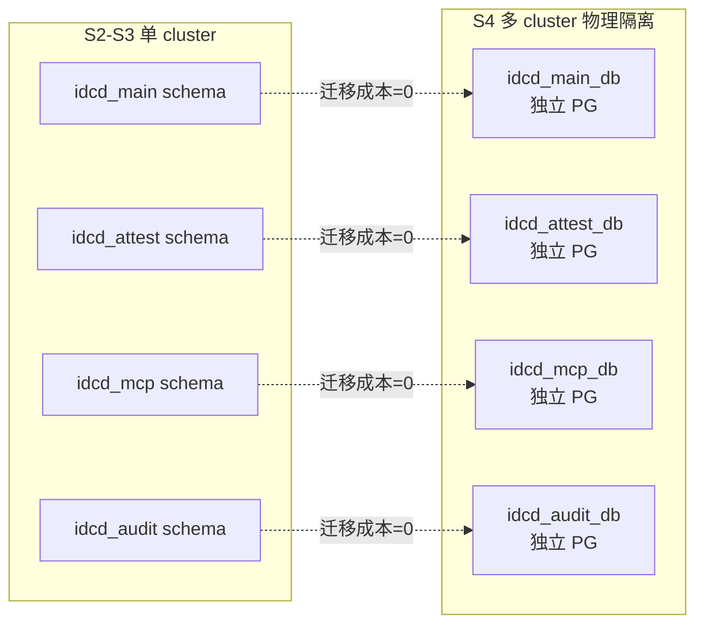

> 因为跨 schema 没有 FK(v2 D1),从单 cluster 拆为多 cluster **只需修改 connection string 路由**(Repository 层),DDL 无需任何变更。

---

## 7. 参考文档

- `/Users/wangzheng/code/idcd/docs/prd/15-data-model.md`(完整 DDL,1665 行)
- `/Users/wangzheng/code/idcd/docs/prd/14-tech-architecture.md`(架构总览)
- `/Users/wangzheng/code/idcd/docs/prd/18-evidence-and-attestation.md` §5(Evidence 信任根)
- `/Users/wangzheng/code/idcd/docs/prd/19-ai-agent-observability.md` §4(Agent obs 数据流)
- `/Users/wangzheng/code/idcd/docs/prd/DECISIONS.md`(K1 / D1-D7 / D-Concern1-3 决策记录)
