# 关键状态机集中 — idcd.com v2.0

> 生成日期:2026-05-13
> 用途:工程实施前的状态机集中查阅;每个状态机都有 Mermaid 图 + transition table + 边缘 case
> 涉及决策:D2 / D4 / D5 / D10 / D11 / D12 / D13 / K4 / D-Concern1 / D-Concern5 / D-Concern6 / D-Concern8 / D-Concern7

本文档**不重复 PRD 内容**,只集中状态机本身;每个状态机均标注来源 PRD 章节,工程实施时回查原文。

---

## 目录

1. [Verdict Order 订单状态机(订单粒度)](#1-verdict-order-订单状态机)
2. [Verdict 生成 step-level WAL 状态机(报告粒度,D4)](#2-verdict-生成-step-level-wal-状态机)
3. [KMS 密钥生命周期状态机(D11)](#3-kms-密钥生命周期状态机)
4. [MCP Token 三态生命周期(D2)](#4-mcp-token-三态生命周期状态机)
5. [Refund Retry 状态机(D5)](#5-refund-retry-状态机)
6. [Anchor 偏差告警分级 + 数据污染恢复(D10 / D-Concern8)](#6-anchor-偏差告警--数据污染恢复状态机)
7. [Status Page Incident LLM 起草状态机(K4)](#7-status-page-incident-llm-起草状态机)
8. [Postmortem LLM 起草状态机(K4 + D8 + D9)](#8-postmortem-llm-起草状态机)
9. [Verdict 工单 SLA 三档分流(D12)](#9-verdict-工单-sla-三档分流状态机)
10. [状态机交叉引用与字段映射](#10-状态机交叉引用与字段映射)

---

## 1. Verdict Order 订单状态机

**来源**:`09-billing.md` §13.5 / `18-evidence-and-attestation.md` §3.2 / `15-data-model.md` §4.X.1(`verdict_order.status`)
**决策**:D4(WAL)/ D5(refund retry)/ D6(self-verify 独立)
**字段**:`verdict_order.status ∈ {pending, paid, generating, delivered, failed, refunded, refund_failed}`

### 1.1 状态机图

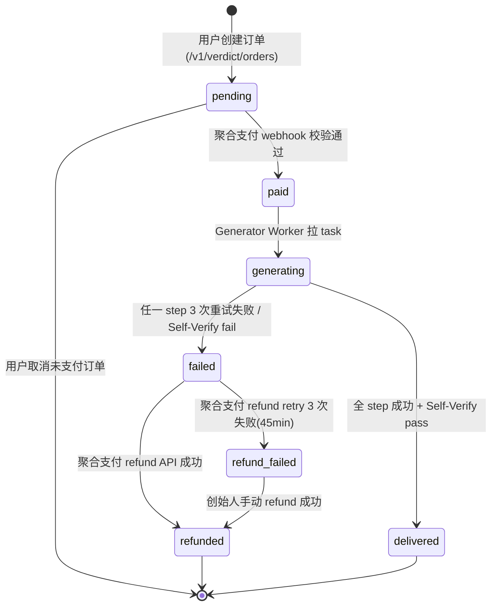

### 1.2 Transition 详细表

| From | To | Trigger | Side Effect | SLA / Retry |
|---|---|---|---|---|
| `pending` | `paid` | 聚合支付 webhook 签名校验通过(`ext_order_id` idempotent) | 入 `verdict_generation_queue`(Redis Stream, idempotency by `order_id`);写 `paid_at` | 聚合支付 webhook 自带重试 6 次 |
| `pending` | (terminal) | 用户主动取消;30 天未支付自动清理 | 订单关闭 | — |
| `paid` | `generating` | Generator Worker 拉 task | `verdict_order.status='generating'`;每 step 前查 `attestation_record` 走 WAL replay(D4) | 立即(< 5s) |
| `generating` | `delivered` | Self-Verify Worker(独立进程)`/verify` 接口返回 valid → 写 `attestation_record(action=self_verified, status=success)` | 邮件 + 站内 + 可选 webhook;写 `delivered_at`;PDF 永久可下载 | P95 < 90s,P99 < 5min |
| `generating` | `failed` | 任一 step 3 次重试失败 / Self-Verify `status=failure` → 入 DLQ | 写 `failed_at`;触发 Refund Worker;系统性聚合 ≥5/h → P0 创始人 | 5min DLQ 告警 |
| `failed` | `refunded` | 聚合支付 refund API 成功(可在 attempt 1/2/3 任一成功) | 写 `refunded_at`;通知用户(若 ≥ T+15min 已发道歉邮箱 → 二次成功通知) | T+0 / T+5min / T+45min |
| `failed` | `refund_failed` | 聚合支付 refund retry 3 次失败(`refund_attempt_count=3`,T+45min) | `refund_last_error` 记录 支付通道风控原因;P0 告警创始人手机 7×24;入 admin dashboard `refund_failed` 队列;**T+15min 道歉邮箱已发** | 45min 上限 |
| `refund_failed` | `refunded` | 创始人手动 refund(联系支付通道客服 / 手动银行转账) | 二次通知用户;入 audit_log + 月度 Verdict 健康月报 | 24h 人工 SLA |

### 1.3 边缘 case

- **Webhook 重发**:聚合支付服务商多次发 webhook,按 `ext_order_id` 唯一约束 idempotent 处理。
- **Worker crash mid-step**:依靠 `attestation_record` WAL(UNIQUE(report_id, action))。重启后:
  ```sql
  SELECT action FROM attestation_record
   WHERE report_id = $1 AND status = 'success';
  -- 跳过已完成 step,从 next pending step 续跑
  ```
- **KMS 间歇失败**:启用 idempotency token(AWS KMS / 阿里云 KMS 均支持),即使 retry 也是同一 sign 结果,KMS audit log 不重复。
- **Self-Verify 失败 + Refund 也失败**:`status=refund_failed`,P0 告警,用户已收 T+15min 道歉邮箱(知情),创始人 24h 内手动处理。
- **数据可用性预检**:订单创建前 `/v1/verdict/quote` 已预检;若数据不足 / 目标黑名单 / 节点 <3 → 直接拒绝下单(不进入 pending),不在本状态机内。
- **强制道歉邮箱独立于 refund 成功**:`refund_apology_sent_at` 字段记录;T+15min 触发不可被 refund 提前成功取消(用户先知情,即使后续 refund 成功也保证体验)。

---

## 2. Verdict 生成 step-level WAL 状态机

**来源**:`18-evidence-and-attestation.md` §3.2 §3.5 / `15-data-model.md` §4.X.3(`attestation_record`)
**决策**:D4(WAL)/ D6(Self-Verify 独立性边界)
**字段**:`attestation_record.status ∈ {pending, success, failure}`,`action ∈ {signed, tsa_stamped, anchored, s3_archived, self_verified, revoked}`

### 2.1 状态机图(step-level)

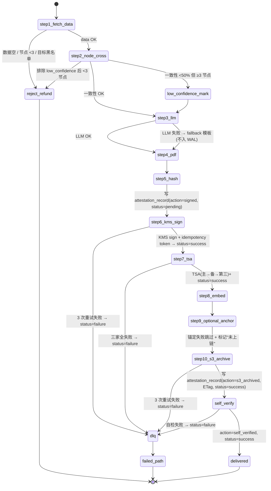

### 2.2 各 step 重试 / Idempotency 策略

| Step | Action(WAL) | Retry 次数 | Idempotency 机制 | Failure 后行为 |
|---|---|---|---|---|
| 1 fetch_data | (无 WAL 写入) | 0 | N/A | 立即 `reject_refund`(订单转 `failed` → 全额退款) |
| 2 node_cross | (无 WAL 写入) | 0 | N/A | 标记 `confidence=low` 继续;若剩 <3 节点 → `reject_refund` |
| 3 LLM | (无 WAL 写入) | 3(per-call) | N/A | fallback 模板(不影响签名链) |
| 4 PDF render | (无 WAL 写入) | 1 | N/A | 转 DLQ |
| 5 content_hash | (无 WAL 写入,纯计算) | 0 | N/A | 转 DLQ |
| 6 KMS sign | `signed` | 3 | **idempotency_key**(KMS request token) | 转 DLQ + P1 告警 |
| 7 TSA stamp | `tsa_stamped` | 3(主→备→第三) | `request_hash` 去重 | 三家全失败 → 转 DLQ + P0 告警 |
| 8 PDF embed | (无 WAL,基于已签名数据) | 1 | 幂等(re-embed 同结果) | 转 DLQ |
| 9 anchor(可选) | `anchored` | 1 | tx 哈希查询 | 跳过 + 报告标注"未上链"(不影响 delivered) |
| 10 S3 archive | `s3_archived` | 3 | S3 ETag | 转 DLQ |
| 11 self_verify | `self_verified` | 0 | N/A(独立进程独立 KMS 客户端) | 转 DLQ → 失败路径 |

### 2.3 WAL replay 关键约束

- **UNIQUE(report_id, action)**:防止 worker crash 重启重复 sign / 重复 TSA / 重复 S3 archive。
- **Worker 续跑逻辑**(伪 SQL):
  ```sql
  SELECT action FROM attestation_record
   WHERE report_id = $1 AND status = 'success';
  -- 跳过已完成 step,从 next pending step 续跑
  ```
- **KMS idempotency_key**:`attestation_record.idempotency_key` 字段持久化;crash 重启 retry 用同一 key,KMS audit log 不重复条目。

### 2.4 Self-Verify 独立性边界(D6)

| 维度 | 强制隔离 |
|---|---|
| 进程 | 独立 docker container,不与 Generator Worker 共享进程空间 |
| VPC subnet | 独立 subnet;仅暴露 `attest.idcd.com/verify` HTTPS 接口,无内部 RPC |
| KMS 客户端 | 独立 KMS 客户端实例 / 配置 / 缓存;通过 verify 接口走 `KMS GetPublicKey`,**不复用** Generator Worker 的 sign 客户端 |
| 代码路径 | 仅调用公开 `/verify` HTTP 接口,与外部第三方用户走的代码路径完全一致 |
| 物理隔离 | S2 起 docker compose 中两个 service 不同 hostname,后期可拆物理机 |

**目的**:Generator 与 Self-Verify bug 不可能同时存在 → 自检失败 = 真实失败,自检通过 = 真实通过。

### 2.5 周期独立审计(Periodic Audit)

每日抽样 10 份历史报告独立验签(独立 Worker)。失败 → 立即停止新生成 + P0 告警(信任根级事故,走 KMS 应急 SOP)。

---

## 3. KMS 密钥生命周期状态机

**来源**:`18-evidence-and-attestation.md` §3.3 §7.1 / `11-admin.md` §15.5 / `12-compliance-and-abuse.md` §20 / `15-data-model.md` §4.X.5(`key_ceremony_log`)
**决策**:D11(Backup HSM 加速通道)/ D-Concern5(revoke 期间历史验签)

### 3.1 Root Key 状态机

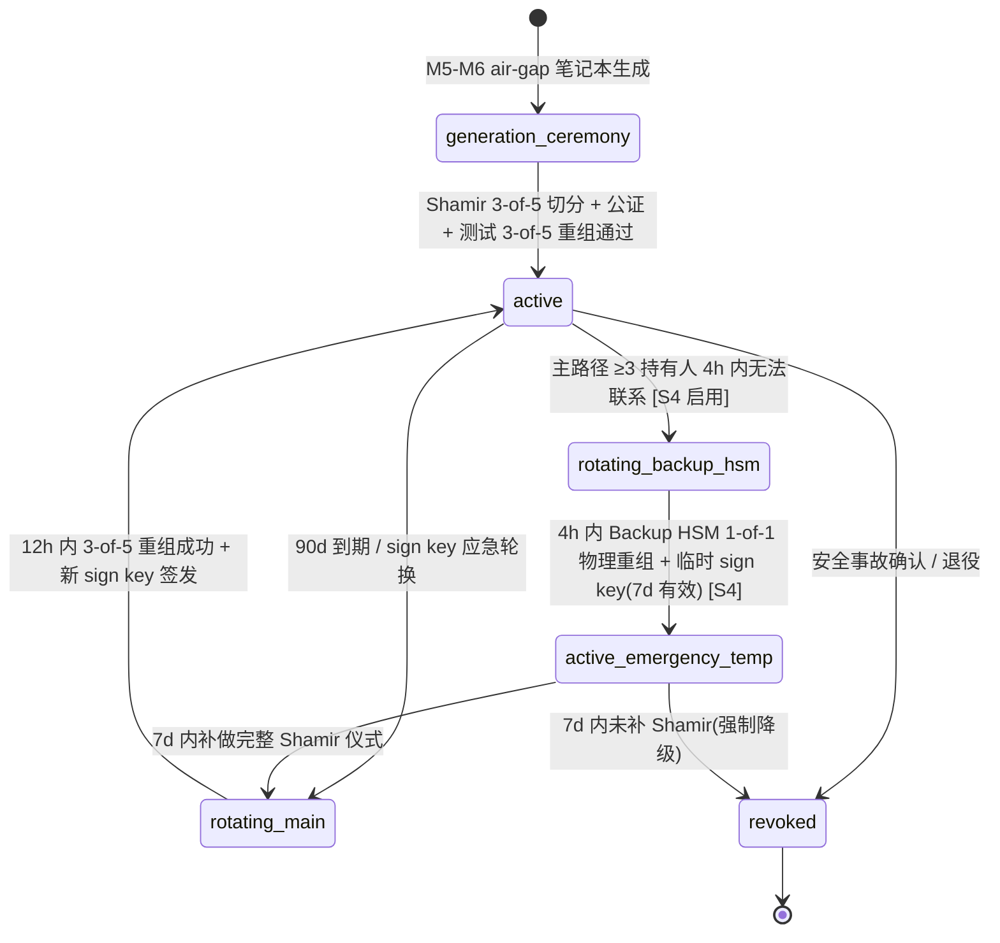

#### Root Key Transition 表

| From | To | Trigger | SOP 来源 | SLA |
|---|---|---|---|---|
| (init) | `generation_ceremony` | M5 准备 air-gap 笔记本 + 5 持有人就位 | 11 §15.5 首次仪式 | — |
| `generation_ceremony` | `active` | Shamir 切分完成 + 公证书出具 + 3-of-5 测试重组通过 | 11 §15.5 | M5-M6 周期 |
| `active` | `rotating_main` | 90d 到期(自动) / 怀疑泄露(应急) | 11 §15.5 / 12 §20 | 12h 目标(应急)|
| `active` | `rotating_backup_hsm` | T+4h 主路径 ≥3 持有人无法联系(D11) | 11 §15.5 加速通道 | 4h 目标 |
| `rotating_main` | `active` | 12h 内 3 持有人提交切片 + 系统重组 root + 签发新 sign key | 12 §20.2 | 12h |
| `rotating_backup_hsm` | `active_emergency_temp` | Backup HSM 1-of-1 物理重组 + 临时 sign key(`emergency_backup` tag, 7d 有效) [S4 启用] | 11 §15.5 / 18 §3.3 | 4h |
| `active_emergency_temp` | `rotating_main` | 7d 内补做完整 Shamir 仪式 | 11 §15.5 | 7d 强制 |
| `active` / `*` | `revoked` | 安全事故确认 / Root 退役 | 12 §20 | — |

### 3.2 Sign Key 状态机

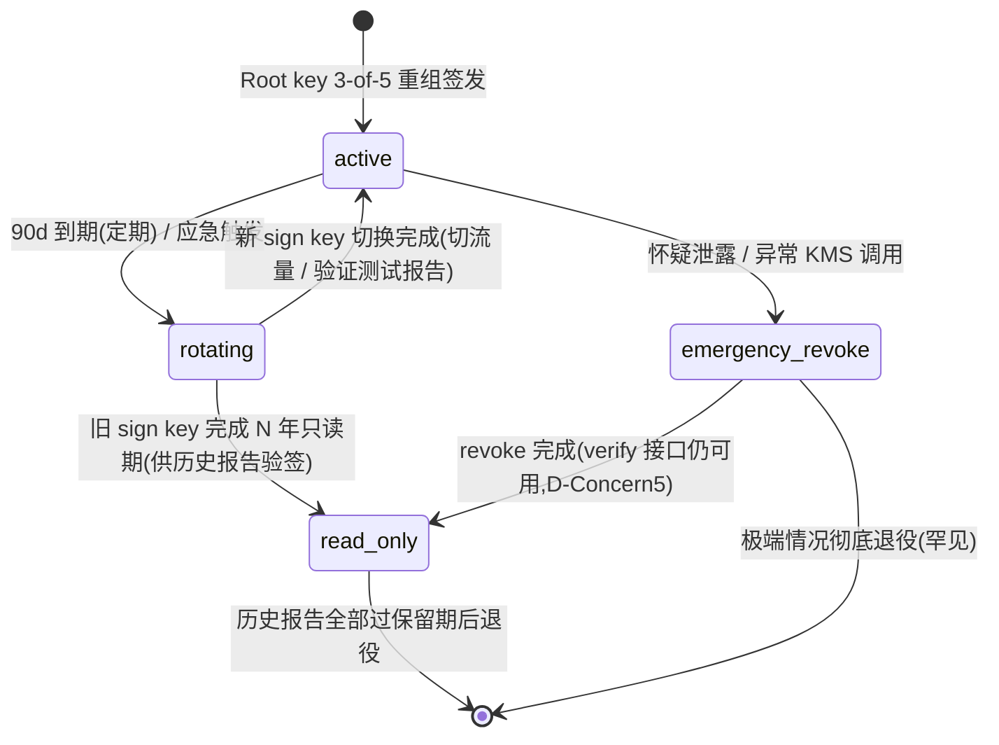

#### Sign Key Transition 表

| From | To | Trigger | Side Effect | SLA |
|---|---|---|---|---|
| (init) | `active` | Root 3-of-5 重组 + 签发新 sign key | KMS audit log 写入;`signature_key_version++` | — |
| `active` | `rotating` | T-7d 系统自动提醒到期 / 应急触发(P0) | Attestation Service 准备切流量 | T-7d 提醒,T+0 启动 |
| `rotating` | `active` | 新 sign key 签一份测试报告 → verify 通过 → 切全部 Worker | Attestation Worker 全部切到新 sign key | T+1h 切换完成 |
| `rotating` | `read_only` | 旧 sign key 完成切换后立即转 read_only | 仅用于历史报告验签;不再签新报告 | — |
| `active` | `emergency_revoke` | 12 §20.1 任一触发(KMS 异常 / 内审 / 第三方报告伪造) | T+5min 冻结 sign key;Attestation Service 切**只读**(停新生成);**`attest.idcd.com/verify` 公开验签接口持续可用**(D-Concern5)| T+5min 冻结 |
| `emergency_revoke` | `read_only` | 应急撤销完成(KMS revoke API + key_version 标记) | 历史报告的对应 key_version 仍可走 `KMS GetPublicKey` 验签 | — |

### 3.3 Backup HSM 加速通道(D11)

| 项 | 规约 |
|---|---|
| **形态** | 冷启动机 + USB HSM(SoftHSM / YubiHSM 2 入极简化),物理在离线保险柜 |
| **重组方式** | 1-of-1,创始人物理获取 + 解锁密码(密码与 Shamir 切片**独立保管**)|
| **触发条件** | 仅在 12h 主路径已启动且 ≥3 Shamir 持有人 4h 内无法联系时启用 |
| **限制** | 仅一次性紧急 sign key 轮换,不参与日常签名;启用后必须 7 天内补做完整 Shamir 仪式 |
| **演练要求** | S2 上线前必做 1 次 Backup HSM 独立重组演练,记录耗时基线 + 每年定期 1 次 |

### 3.4 边缘 case

- **revoke 期间历史报告验签**:`emergency_revoke` 不删除该 key_version 的 public key 记录;只 revoke 私钥签新报告的能力。`/v1/attest/verify` 接口在整个 revoke 期间持续可用(D-Concern5)。
- **新报告生成停摆窗口**:从 `emergency_revoke` 到 `active`(新 sign key)期间,新 Verdict 订单进入 `paid` 但 Generator Worker 不消费(系统切只读),订单超 SLA 后转失败路径全额退款。
- **未演练的 SOP = 空话**:S2 上线前演练记录入 `/attest/key-ceremony` 后台 + 每年定期演练,记录持有人联络耗时 / 物理获取耗时 / 系统切换耗时基线。

---

## 4. MCP Token 三态生命周期状态机

**来源**:`03-account-system.md` §5a / `12-compliance-and-abuse.md` §22 / `15-data-model.md` §4.X.8(`mcp_token`)
**决策**:D2(三态 + 无永久 + auto_renewal)/ D-Concern6(GitHub 扫描)

### 4.1 状态机图

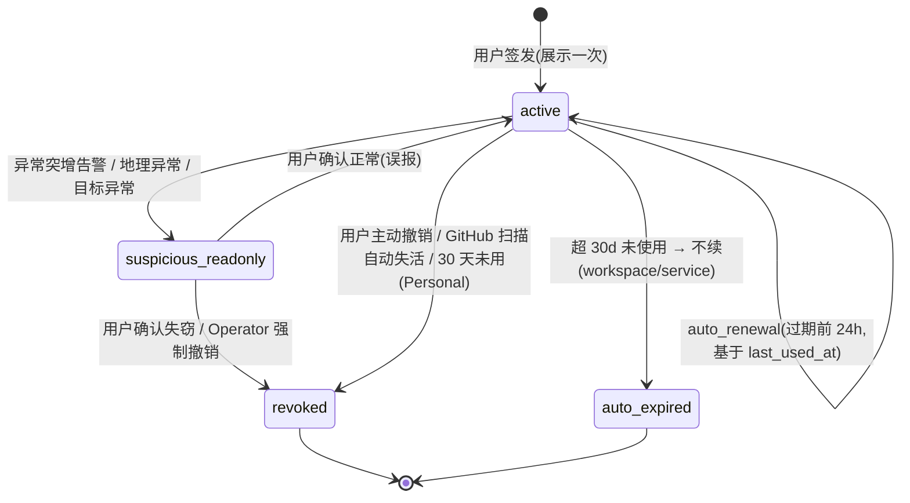

### 4.2 三态对照表(D2)

| 形态 | 适用场景 | 有效期 | Auto-renewal | IP 白名单 | 30d 不用 | 签发方式 |
|---|---|---|---|---|---|---|
| **Personal** | 开发者本地(Cursor / Claude Code) | **24h** | OAuth-like 自动 refresh | 可选 | 自动 `auto_expired` | 用户控制台手动签发,展示一次 |
| **Workspace** | 团队级生产(Team / Business 订阅绑定) | **90d** | 过期前 24h auto_renew(基于 `last_used_at`)| 强烈推荐 | 不续(等同 `auto_expired`)| 团队管理员签发 |
| **Service** | 生产 Agent 服务(长期运行) | **90d** | 过期前 24h auto_renew | **强制**(无白名单不签发) | 不续(等同 `auto_expired`)| 团队管理员签发 |

> **D2 原则**:不存在"永久 / 长期"token。`expires_at` 必填,最长 90 天。auto_renewal 让用户体验等同永久,但 90 天滚动失效大幅降低凭证泄露损失上限。

### 4.3 Transition 详细表

| From | To | Trigger | Side Effect | 检测来源 |
|---|---|---|---|---|
| (init) | `active` | 用户/管理员 `POST /app/mcp/tokens`(service 强制 IP 白名单)| `mcp_token` 写入 + token 原文展示一次 + 教育弹窗 | 用户主动 |
| `active` | `active`(renewed) | 过期前 24h + `last_used_at` 在 30d 内 | `last_renewed_at = now()`;`expires_at += 90d`(或 24h personal)| 后台定时 Worker |
| `active` | `suspicious_readonly` | 24h 调用量 > 历史 P95 × 5(D-Concern6)/ 地理 IP 跳变 / 测试目标突变 | 控制台展示 `suspicious` 标识;调用降级为只读;邮件 + 站内通知用户 | 12 §22 应急 SOP |
| `suspicious_readonly` | `active` | 用户确认正常(回包"误报")| 恢复正常调用;suspicious flag 清零 | 用户控制台 |
| `suspicious_readonly` | `revoked` | 用户确认失窃 / 30min 内未响应 | `revoked=true`;active session 立即断开;受影响 tool call 标记可疑;涉及 budget 触发退款评估 | 12 §22 |
| `active` | `revoked` | 用户主动撤销 / GitHub 扫描自动失活 / Operator 强制撤销 | `revoke_reason` 记录;active session 立即断开 | 用户 / 自动扫描 / Operator |
| `active` | `auto_expired` | Personal 30d 未用 / Workspace 或 Service 超 `expires_at` 且 `last_used_at` 超 30d 不续 | `expires_at < now()`;鉴权失败 | 后台定时 Worker |

### 4.4 边缘 case

- **GitHub token 扫描自动失活(D-Concern6,S3 alpha 前定型)**:选定 GitGuardian / 自家正则 / TruffleHog 任一。发现 leaked token → 自动 `revoked` + 邮件通知用户。
- **签发时 IP 白名单缺失(service)**:HTTP 400 拒绝签发;控制台前端在保存前强制校验。
- **Renewal 时 last_used_at 超 30d**:不续 → 走 `auto_expired`;用户重新签发即可。
- **跨 schema FK**:`mcp_token.owner_id` 跨 schema 不写 FK,应用层 Repository 校验存在(详 15 §4.X.8)。

---

## 5. Refund Retry 状态机

**来源**:`09-billing.md` §13.5 / `11-admin.md` §15.4 类别 A
**决策**:D5(retry queue + 强制道歉邮箱)
**字段**:`verdict_order.refund_attempt_count`、`refund_last_error`、`refund_apology_sent_at`

### 5.1 状态机图

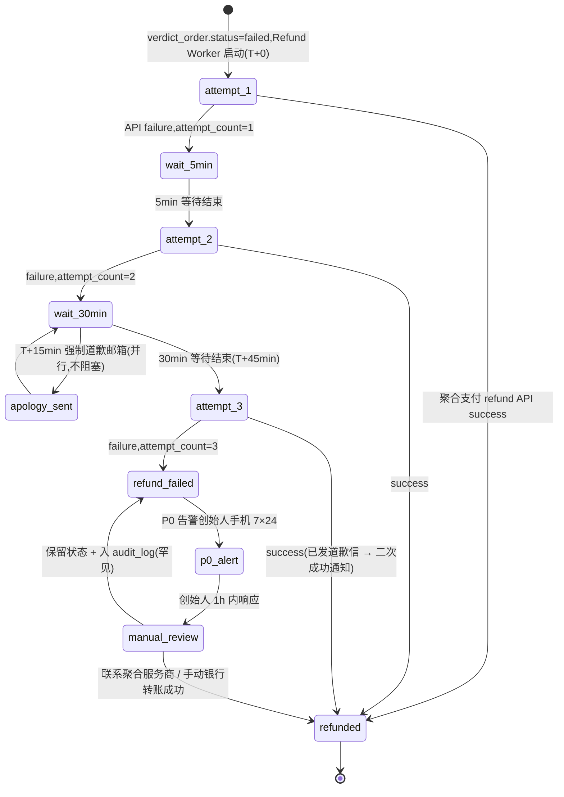

### 5.2 关键时间点(D5)

| T | 动作 | 用户感知 |
|---|---|---|
| T+0 | `failed` 状态,Refund Worker 启动;`attempt_1` 聚合支付 refund API | (无,系统内部)|
| T+5min | 若失败 → `attempt_2` | (无)|
| **T+15min** | **强制道歉邮箱**(无论 refund 是否成功)| 用户收信:"由于 [失败类别] 无法生成报告,已发起全额退款 ¥XXX。若 1-3 工作日内未到账,请回复此邮件,我们手动处理。" |
| T+45min | `attempt_3` → 若失败 → `refund_failed` + P0 告警创始人手机 | 用户已知情(道歉信已发);后台告警仅运营 |
| T+1-24h | 创始人手动处理(联系聚合服务商 / 手动银行转账)| 退款到账后二次通知 |

### 5.3 关键约束

- **强制道歉邮箱独立于 refund 是否成功**:`refund_apology_sent_at` 字段记录;到 T+15min 必发。即使 `attempt_2`(T+5min)已经成功也照发(给用户最差情况下的承诺感)。**取舍**:轻微体验冗余 > 用户长时间不知情。
- **系统性问题升级**:同时段 ≥5 失败/小时 → 转工单类别 C(P0 创始人手机告警);Refund Worker 仍按单订单继续 retry。
- **手动 review 失败保留**:罕见情况下手动 review 后仍无法 refund,`refund_failed` 保留 + audit_log 写入 + 月度健康月报披露。

---

## 6. Anchor 偏差告警 + 数据污染恢复状态机

**来源**:`10-nodes-and-agents.md` §6.5 §6.6 / `12-compliance-and-abuse.md` §21
**决策**:D10(阈值 calibration)/ D12(节点失窃 1h P0)/ D-Concern8(向前回溯审查)

### 6.1 偏差分级状态机

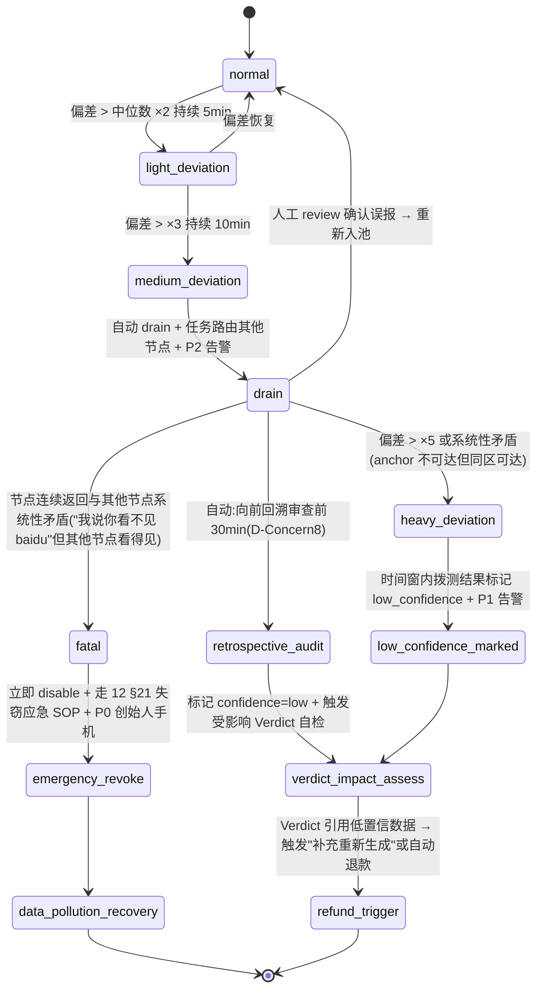

### 6.2 偏差分级表(S1 placeholder,D10 待 S2 calibration)

| 严重度 | 判定(S1 placeholder)| 自动处理 | 告警等级 |
|---|---|---|---|
| **轻度** | 单节点对 anchor RTT 偏差 > 同区域中位数 ×2,持续 5min | 标记 `confidence=low`(仅该节点拨测结果) | 内部 W1 |
| **中度** | 偏差 > ×3,持续 10min | 自动 `drain` + 任务路由其他节点 | 内部 P2 |
| **高度** | 偏差 > ×5,或与其他节点出现"系统性矛盾"(anchor 不可达但同区其他节点可达)| 立即 `drain` + **当前时间窗该节点拨测结果标记低置信** + 影响的 Verdict 报告自检 | 内部 P1 + 运维告警 |
| **致命** | 节点连续返回与其他节点系统性矛盾(如"我说你看不见 baidu"但其他节点说看得见)| 立即 `disable` + 走 12 §21 失窃应急 SOP | **P0 创始人手机** |

> **D10 锁定**:×2 / ×3 / ×5 为 S1 placeholder。S2 上线前必完成 30 天 baseline 数据校准报告,基于真实分布调整;不同区域 / 时段差异化;入 `anchor_deviation_threshold` 配置表(可热更新)。

### 6.3 数据污染恢复流程(节点粒度 → 报告粒度)

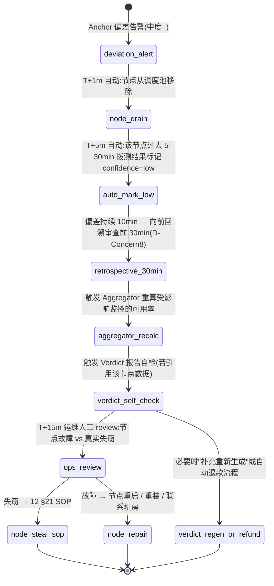

### 6.4 D-Concern8 向前回溯审查

- 偏差持续 10min:**不仅标记最后 10min,还回溯审查前 30min 数据**。
- 检测渐进式增长趋势(0 → 阈值)→ 扩大标记窗口到前 30 分钟。
- **防御场景**:攻击者"先 8 分钟正常 + 后 2 分钟造假"→ 向前回溯检测异常增长 → 不仅标记后 2 分钟也标记前异常增长期。
- 若排除 `low_confidence` 节点后剩余节点 <3 → 受影响 Verdict 报告**拒绝生成 + 自动退款**(防止数据强度不足)。

### 6.5 节点失窃应急流程(D12,21.2)

| T | 动作 | 触发主体 |
|---|---|---|
| T+0 | 检测告警(CRL/OCSP / Anchor 偏差 / fingerprint 突变 / 流量异常) | 监控 Worker |
| T+1m | 自动:节点从调度池移出(drain)| Scheduler |
| T+5m | 自动:撤销节点客户端证书(CRL 推送)+ P0 告警创始人手机 7×24 | Cert Manager + Alerting |
| T+15m | 自动:相关时间窗拨测结果标记低置信(D-Concern8 向前回溯)+ 影响的 Verdict 报告自检 → 必要时自动 refund | Aggregator |
| **T+1h** | **创始人本人 1h 内 review**:确认真失窃 vs 误报 | 创始人 |
| T+24h | 节点机器重装 + 重新签发证书 + 重新入池 | Operator |
| T+72h | post-mortem(LLM 起草 + 创始人 review) | Postmortem Worker(详 §8)|

---

## 7. Status Page Incident LLM 起草状态机

**来源**:`06-status-pages.md` §5.7 §5.8 / `15-data-model.md` `status_incident.public_announcement_draft`
**决策**:K4(LLM 自动起草)/ D9(Provider 抽象)/ D-Concern7(隐私边界)

### 7.1 状态机图

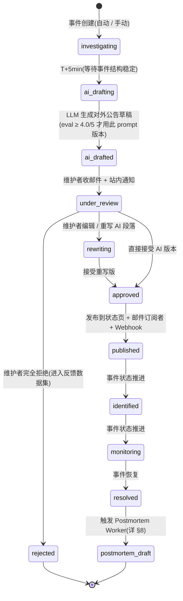

### 7.2 Transition 详细表

| From | To | Trigger | Side Effect | 约束 |
|---|---|---|---|---|
| (init) | `investigating` | 监控触发 / 维护者手动创建 | `status_incident.status='investigating'`;自动时间线写入(06 §5.7) | — |
| `investigating` | `ai_drafting` | T+5min 后(等待事件结构稳定,避免立即起草后又改)| 调用 LLM(详 6.3),输入结构化事件数据 | Provider 抽象层(D9);prompt 版本 (provider, version) |
| `ai_drafting` | `ai_drafted` | LLM 返回 Markdown(50-300 字符短公告)| 写 `public_announcement_draft` + `status=ai_drafted` | 长度 50-300;禁止断言责任方 / 具体恢复时间 / 赔偿数字 |
| `ai_drafted` | `under_review` | 邮件 + 站内通知维护者 | UI 顶部水印"AI 起草草稿,等待人工审核" | 强制人工审核(默认);"自动发布"开关默认 OFF |
| `under_review` | `rewriting` / `approved` | 维护者编辑 / 接受 | 反馈写入 prompt eval 数据集 | — |
| `under_review` | `rejected` | 维护者完全拒绝(罕见)| 拒绝原因入数据集 → 影响下次 prompt eval | — |
| `rewriting` / `under_review` | `approved` | 维护者勾"已审核,我对内容负责" | `approved_by` + `approved_at` | — |
| `approved` | `published` | 发布按钮 | 推送状态页 + 邮件订阅者 + 微信 / 钉钉 + Webhook;事件可流转 `identified` 等 | — |
| `resolved` | `postmortem_draft` | 事件 resolve T+5min | 触发 Postmortem Worker(详 §8) | — |

### 7.3 Prompt 约束(避免幻觉)

- 输出严格 Markdown(无 HTML)
- 长度 50-300 字符(短公告)
- **禁止**:断言责任方 / 提及具体人名团队 / 承诺具体恢复时间 / 提供赔偿数字
- **必须**:致歉 / 影响范围 / 持续更新承诺 + 频率 / 联系方式
- **离线 eval**:每月 50 个真实事故公告,人工打分 ≥ 4.0/5 才允许新版 prompt 上线

---

## 8. Postmortem LLM 起草状态机

**来源**:`07-reports-and-dashboards.md` §6.1-6.5 / `15-data-model.md` §4.X.14(`postmortem`)
**决策**:K4(LLM 起草)/ D8(eval bootstrap)/ D9(Provider 抽象)/ D-Concern7(隐私边界)

### 8.1 状态机图

```mermaid
stateDiagram-v2
    [*] --> event_resolved: monitor_event.status=resolved
    event_resolved --> data_collecting: T+5min Postmortem Worker 拉取结构化输入
    data_collecting --> llm_drafting: T+10min 输入 prompt(per-Provider version)
    llm_drafting --> ai_drafted: LLM 返回 Markdown(章节固定 schema)
    ai_drafted --> human_review: 邮件 + 站内通知事件 owner / 团队管理员;UI 灰显 + 水印
    human_review --> section_editing: 用户对每段"接受 AI 草稿"或"重写"
    section_editing --> published: 勾选"已审核,我对内容负责"→ 发布
    section_editing --> rejected: 完全拒绝(进入反馈数据集)
    human_review --> rejected
    published --> [*]
    rejected --> [*]
```

### 8.2 Transition 详细表

| From | To | Trigger | Side Effect | 约束 |
|---|---|---|---|---|
| `event_resolved` | `data_collecting` | T+5min Postmortem Worker 启动 | 拉事件元数据 / 时间线 / 节点维度 / DNS-SSL-路由 / 相似历史 | — |
| `data_collecting` | `llm_drafting` | T+10min 输入 prompt(详 07 §6.2 yaml schema)| 调用 LLM via Provider 抽象层 | per-Provider prompt version 独立 eval;baseline 仅 Claude + GPT |
| `llm_drafting` | `ai_drafted` | LLM 返回 Markdown(章节固定:概要 / 时间线 / 节点偏差 / 根因建议 / 改进措施)| 写库 `status=ai_drafted` + UI 灰显 + 顶部水印"AI 起草草稿,等待人工审核" | "AI 草稿,需验证" 开头;严格 schema;根因建议必须用"推测 / 可能 / 建议进一步检查"弱化措辞;**禁止断言** |
| `ai_drafted` | `human_review` | 邮件 + 站内通知事件 owner / 团队管理员 | 进入 `/app/reports/postmortems/<id>` 编辑界面 | — |
| `human_review` | `section_editing` | 用户点击编辑 | 每段独立"接受 / 重写" toggle | — |
| `section_editing` | `published` | 勾选"已审核,我对内容负责"+ 发布按钮 | 推送状态页(可选)+ 团队分享 + PDF 导出 + 公开链接(可选) | — |
| `*` | `rejected` | 用户完全拒绝 / 24h 未审核被取消 | 反馈进入 eval 数据集(D8 bootstrap) | — |

### 8.3 LLM Provider / Prompt 约束(D9 + D-Concern7)

- **Provider 抽象层**(D9):接口统一,后端可插拔(详 14 §4.11)。
- **Prompt 不跨 Provider 一致**:同一 prompt template 在 Claude vs GPT 输出风格 / schema / 鲁棒性不同。baseline 仅 Claude + GPT 维护;企业接入自家 LLM 需自行 prompt 调优 + eval ≥ 4.0/5 才可用。
- **per-Provider prompt eval**:每个 prompt 有 `(provider, version)` 二元 key;Claude v2.4 可独立 ship 不需等 GPT v2.4。
- **法律边界**:不允许提及任何具体人名 / 团队 / 组织过失;具体责任方(如"AWS 出口故障")必须标注"基于公开信息推断,非事实"。
- **隐私边界(D-Concern7)**:用户私有监控数据进入 LLM 前 sanitize(去除 token / cookies / 私有 IP 段)。

---

## 9. Verdict 工单 SLA 三档分流状态机

**来源**:`11-admin.md` §15.4
**决策**:D5(refund retry)/ D11(KMS 应急)/ D12(节点失窃 1h P0)/ D13(三档 SLA)

### 9.1 工单 SLA 分流图

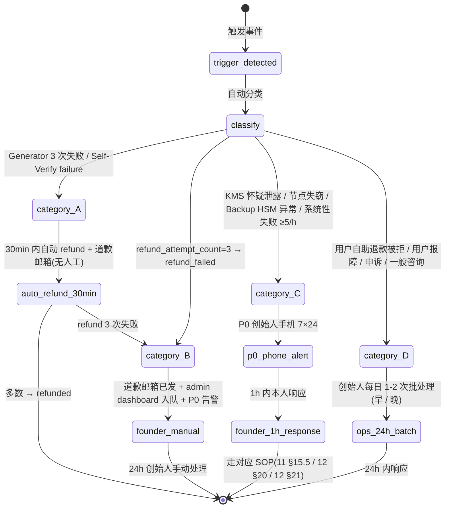

### 9.2 工单分类 SLA 表

| 类别 | 触发条件 | SLA | 处理方 | 处理路径 |
|---|---|---|---|---|
| **A:纯自动** | Generator 3 次重试失败 / Self-Verify failure | **30min 内自动**:聚合支付 refund + 道歉邮箱(无需人工)| Refund Worker(无人工)| 详 §5 Refund Retry |
| **B:Refund 失败** | 聚合支付 refund retry 3 次失败 → `refund_failed` | 道歉邮箱已发 + admin dashboard 入队 + P0 告警 | 创始人手动联系聚合服务商客服 / 银行 | 24h 人工处理 |
| **C:1h P0 本人响应** | KMS 怀疑泄露 / 节点失窃 / Backup HSM 异常 / 系统性失败(≥5 失败/小时)| **1h 内创始人响应**(手机告警 7×24)| 创始人本人 | 走 11 §15.5(KMS)/ 12 §20(KMS 应急)/ 12 §21(节点失窃)SOP |
| **D:24h 常规客服** | 用户自助退款被拒 / 用户报障 / 申诉 / 一般咨询 | 24h 内(出差/假期都可)| Operator / 创始人邮件批处理 | /support/tickets 批处理;出差前预先回复"24h 响应"自动回复 |

### 9.3 工单看板(admin dashboard)

- **类别 A 实时统计**:今日 Verdict 生成成功率 / 自检通过率 / 自动退款率
- **类别 B refund_failed 队列**:所有 refund 失败订单,按超时排序
- **类别 C P0 告警历史**:KMS / 节点失窃 / 系统性失败事件
- 按失败 step 分类
- 同时段集中失败的"系统性问题"自动聚合告警(≥ 5 失败/小时 → P0 → 创始人手机)

---

## 10. 状态机交叉引用与字段映射

### 10.1 状态机 ↔ PRD 章节 ↔ 决策

| # | 状态机 | 主 PRD 章节 | 数据表(15) | 决策 |
|---|---|---|---|---|
| 1 | Verdict Order | 09 §13.5,18 §3.2 | §4.X.1 `verdict_order` | D4, D5, D6 |
| 2 | Verdict 生成 step WAL | 18 §3.2 §3.5 | §4.X.3 `attestation_record` | D4, D6 |
| 3 | KMS Lifecycle | 18 §3.3 §7.1,11 §15.5,12 §20 | §4.X.5 `key_ceremony_log` | D11, D-Concern5 |
| 4 | MCP Token | 03 §5a,12 §22 | §4.X.8 `mcp_token` | D2, D-Concern6 |
| 5 | Refund Retry | 09 §13.5,11 §15.4 类别 A | §4.X.1 `verdict_order` (refund_*) | D5 |
| 6 | Anchor 偏差 + 数据污染 | 10 §6.5 §6.6,12 §21 | (Anchor 检测无单独表) | D10, D12, D-Concern8 |
| 7 | Incident LLM 起草 | 06 §5.7 §5.8 | `status_incident.public_announcement_draft` | K4, D9, D-Concern7 |
| 8 | Postmortem LLM 起草 | 07 §6.1-6.5 | §4.X.14 `postmortem` | K4, D8, D9, D-Concern7 |
| 9 | Verdict 工单 SLA 三档 | 11 §15.4 | (`support_ticket` 类别 + dashboard 视图) | D5, D11, D12, D13 |

### 10.2 关键字段速查

| 状态机 | 表 | 关键 status 字段 | 枚举值 |
|---|---|---|---|
| 1 Verdict Order | `verdict_order` | `status` | `pending` / `paid` / `generating` / `delivered` / `failed` / `refunded` / `refund_failed` |
| 2 Verdict step WAL | `attestation_record` | `action` + `status` | action: `signed` / `tsa_stamped` / `anchored` / `s3_archived` / `self_verified` / `revoked` ; status: `pending` / `success` / `failure` |
| 2 Verdict report | `verdict_report` | `self_verify_status` | `pass` / `fail` / `pending` |
| 3 KMS | `key_ceremony_log` | `action` | `root_gen` / `root_split` / `sign_key_rotate` / `emergency_revoke` |
| 4 MCP Token | `mcp_token` | `revoked` + `expires_at` + `auto_renew` | revoked: boolean ; type: `personal` / `workspace` / `service` |
| 5 Refund Retry | `verdict_order` | `refund_attempt_count` + `refund_apology_sent_at` + `refund_last_error` | count: 0..3 |
| 6 Anchor 偏差 | (节点表 + 拨测结果时序)| `confidence` | `high` / `medium` / `low` |
| 6 Verdict report | `verdict_report` | `confidence_label` | `high` / `medium` / `low` |
| 7 Incident | `status_incident` | `status` + `public_announcement_draft` | `investigating` / `identified` / `monitoring` / `resolved` + LLM draft 阶段 |
| 8 Postmortem | `postmortem` | `status` | `ai_drafted` / `human_review` / `published` / `rejected` |

### 10.3 跨状态机联动

| 触发源 | 联动状态机 |
|---|---|
| Verdict Order 转 `failed` | 触发 §5 Refund Retry 状态机 |
| Refund Retry 转 `refund_failed` | 触发 §9 工单类别 B → P0 告警创始人 |
| §6 Anchor 偏差"致命" | 触发 §3 KMS 应急 SOP 检查 + §9 工单类别 C |
| §6 节点失窃自动 drain + 标记低置信 | 触发 §1 Verdict Order 自检 → 受影响订单走失败路径(§5)|
| §7 Incident `resolved` | T+5min 触发 §8 Postmortem LLM 起草 |
| §3 KMS `emergency_revoke` | §1 Verdict Order 在 `paid` 状态停止消费(系统切只读),超 SLA 后转 `failed`(§5)|
| §4 MCP Token `suspicious_readonly` | 30min 内用户未响应 → 转 `revoked` + 涉及 budget 触发退款评估 |

---

## 附录:Mermaid 渲染说明

- 全部使用 `stateDiagram-v2` 语法,GitHub 渲染兼容
- 复杂状态机(§2 / §6 / §7 / §8)采用 step / sub-state 拆解,避免单图过 30 节点
- 状态名使用 snake_case;转移条件使用中文(可读)
- `[*]` 表示初始 / 终态;`(internal)` / `(terminal)` 在文字中说明
- 部分状态机为简化省略了次要 transition(如 `pending` → 取消),详见各 transition 表的边缘 case 行

> **使用建议**:工程实施时**先看 Mermaid 图理解骨架,再查 transition 表对齐字段,最后回 PRD 原章节读完整上下文**。本文档不替代 PRD,仅作"状态机集中索引"。
